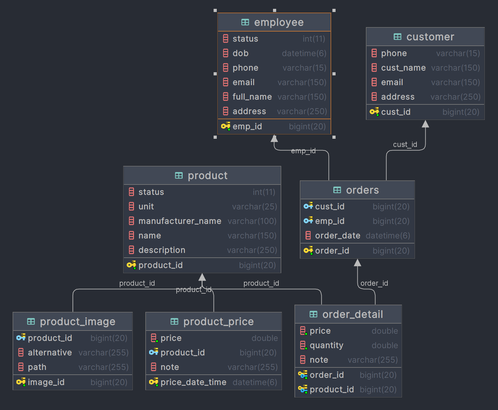
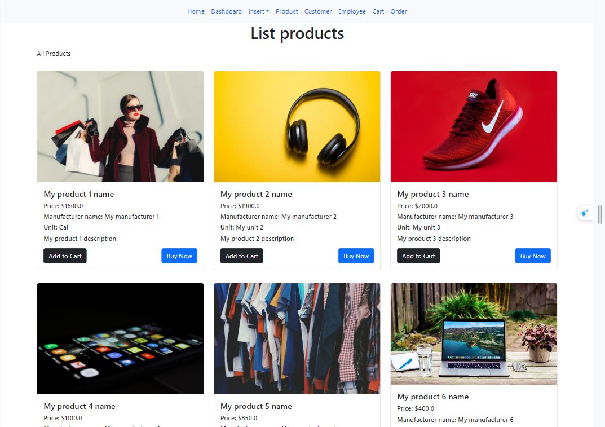
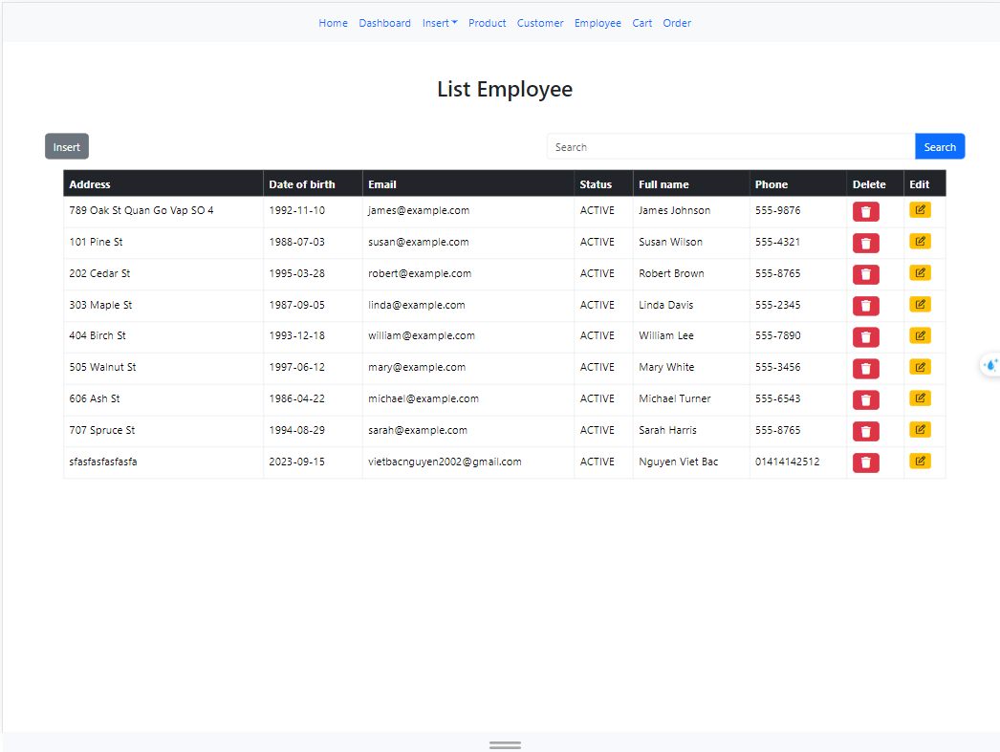
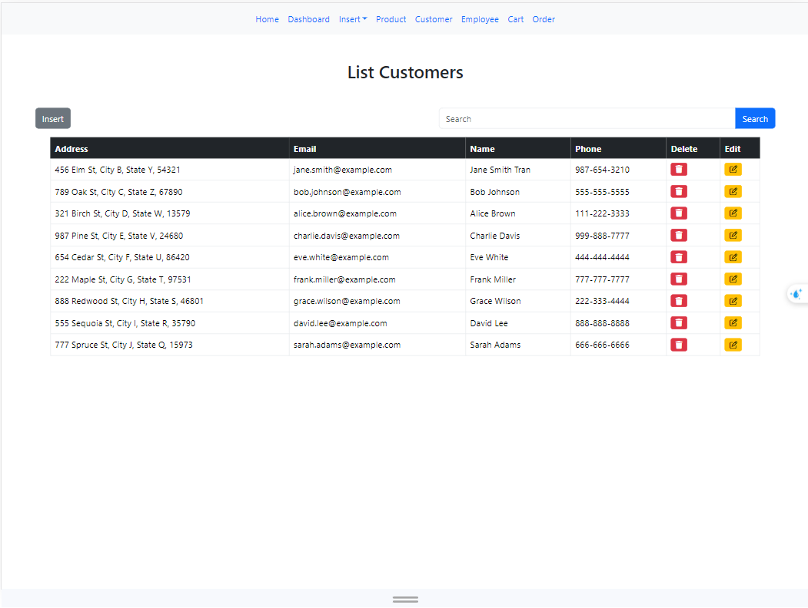
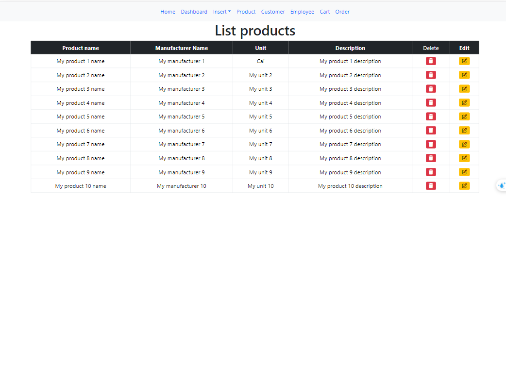
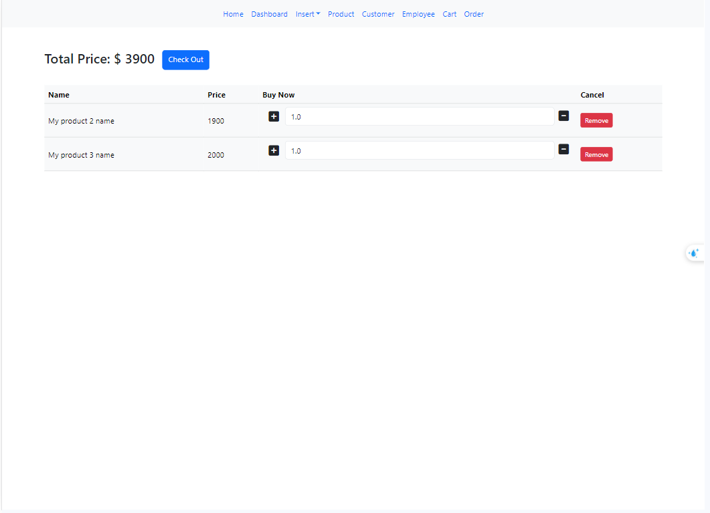
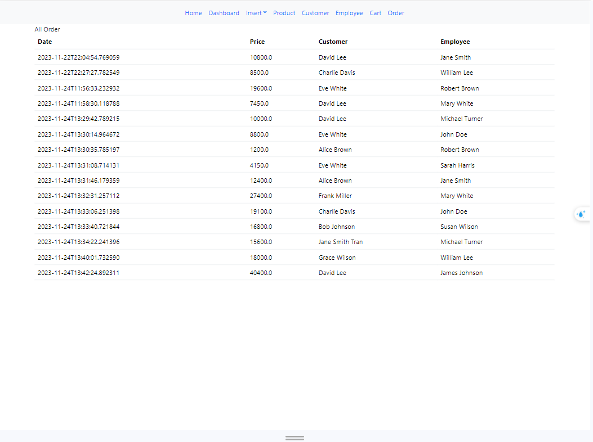
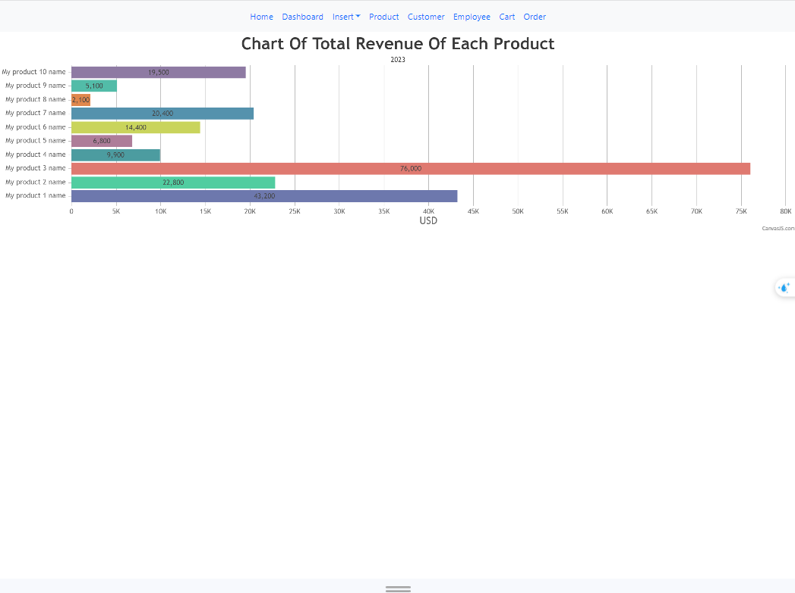

# WWW_NguyenVietBac_Lab02
# 💻 Công nghệ và công cụ sử dụng
   

### Giới thiệu chương trình
Chương trình quản lý bán hàng cung cấp một cách thức dễ dàng cho việc mua hàng cũng như quản lý sản phẩm cùng các bên liên quan
### Sơ đồ database của hệ thống

### Chức năng của chương trình
  - Trang chủ của chương trình

  

- Quản lý nhân viên:
  + Thêm nhân viên
  + Xóa nhân viên
  + Cập nhật thông tin nhân viên
    
  

- Quản lý khách hàng:
  + Thêm khách hàng
  + Xóa khách hàng
  + Cập nhập thông tin khách hàng
  

- Quản lý sản phẩm:
  + Thêm sản phẩm
  + Xóa sản phẩm
  + Cập nhập thông tin sản phẩm

- Tạo đơn hàng cho khách hàng

- Quản lý đơn hàng

- Biểu đồ tổng số tiền của sản phẩm đó bán được

  
  

  
